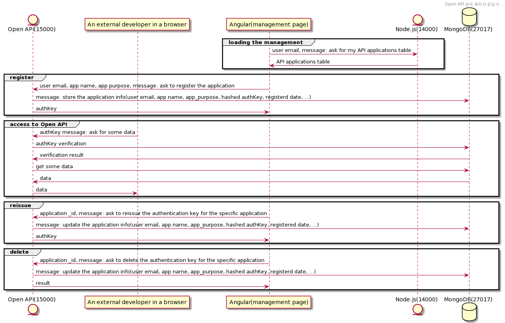

# TIBigdataOpenAPI_server
The middleware was developed by the data team in KUBIC, Korea Unification Bigdata Center.    
Using Flask modules in Python, it authenticates external developers (the users already registered in Mongo User Database) through proper procedures, and then brings KUBIC data from the backend server (Elastic Search Database) to provide API for them.

## Copyright and License
### Templates
Copyright 2013-2020 Start Bootstrap LLC. Code released under the [MIT](https://github.com/StartBootstrap/startbootstrap-simple-sidebar/blob/gh-pages/LICENSE) license.